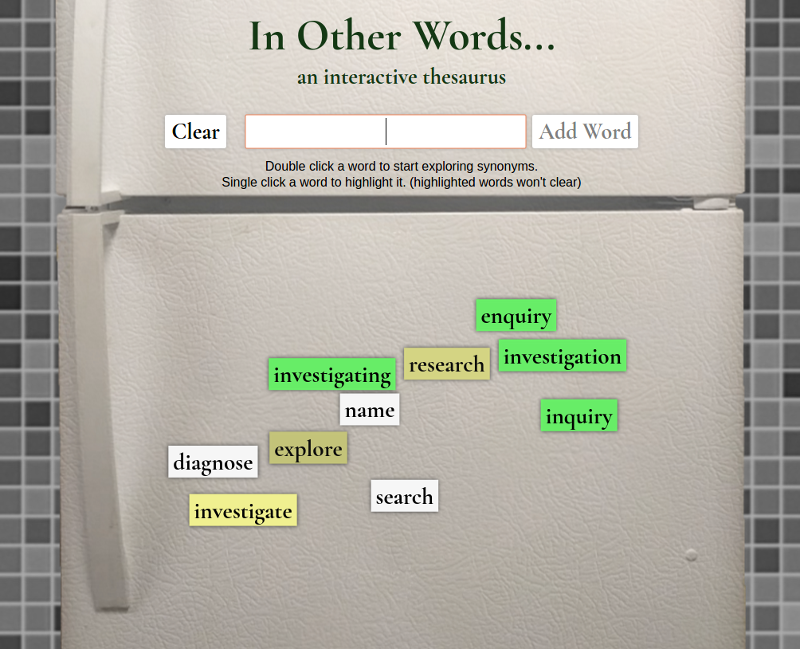

# In Other Words

[Live Site](https://samtfm.github.io/in-other-words/)

In Other Words is a fun tool for brainstorming. Double-click on words to generate synonyms. Use a single-click to highlight your favorites.




# Tools/Technologies
  - [Big Huge Thesaurus API](https://words.bighugelabs.com/api.php)
  - HTML Canvas
  - Webpack

# Implementation

## Words

Synonyms are fetched using the Big Huge Thesaurus API. Exploring a word only calls the API once on the first double-click. A complete list of synonyms is stored internally, and then dispensed in smaller groups with each successive double-click.

## Colors

`color.js` is a lightweight class for handling rgba colors. Colors can be mixed to create fade effects between to colors.


## Physics

Collisions are detected by calculating axis-aligned boxes for each word. At each overlap found, a collision object is returned and added to an array. Once all the collisions have been found for a frame, they are resolved by applying an impulse vector to the object.
```js
// board.js

updateVelocities(){
  const collisions = [];
  // Accumulate all collisions between words
  this.words.forEach(wordA => {
    this.words.forEach(wordB => {
      if (wordA !== wordB && wordA.active && wordB.active) {
        let collision = wordA.checkCollision(wordB);
        // checkCollision returns a reference to wordA, and a vector that
        // points away from wordB, proportional to how much they overlap
        if (collision) {
          collisions.push(collision);
        }
      }
    });
  });
  // Once all collisions have been calculated for a frame, they can be applied.
  // Collisions are resolved by updating both the position AND velocity
  // for a dampened but smooth bounce effect.
  collisions.forEach(({object, impulse}) => {
    // Add to velocity. Gives words a little bit of momentum when moving apart.
    object.vel.x += Math.sign(impulse.x)*.3;
    object.vel.y +=  Math.sign(impulse.y)*.1;

    // Directly update position. Quickly resolves overlaps without sending
    // words flying apart at high speeds
    object.pos.x += impulse.x/5;
    object.pos.y += impulse.y/5;
  });
}
```

# Further Development
  - Allow canvas to appropriately resize with window.
  - Factor out physics logic from `word.js` into a separate class
  - Optimize physics logic to only check for collisions on objects that have recently moved
